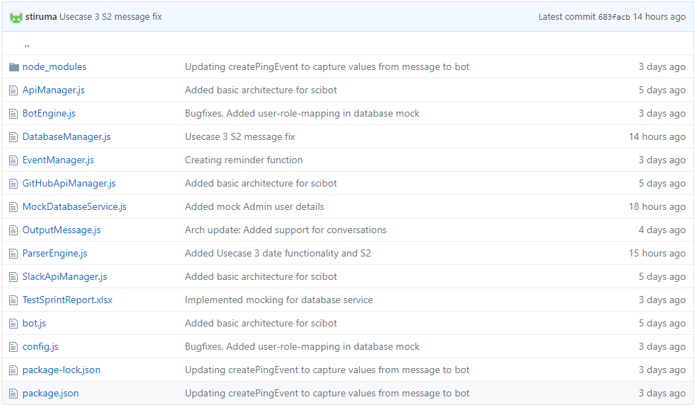

# MILESTONE: BOT

## Index
1. [Use Cases](#usecase)
	* [Use Case 1](#usecase1)
	* [Use Case 2](#usecase2)
	* [Use Case 3](#usecase3)
2. [Mocking](#mocking)
3. [Bot Implementation](#implement)
	* [Bot Platform](#platform)
	* [Bot Integration](#integration)
4. [Selenium Testing](#test)
	* [Use Case 1](#test1)
	* [Use Case 2](#test2)
	* [Use Case 3](#test3)
5. [Task Tracking](#track)
6. [Screencast](#screencast)

## <a name="usecase"></a> 1. USECASES

### <a name="usecase1"></a> USECASE 1: Pinging a user for daily updates

```
The first use case is to schedule a daily scrum and ask the users questions regarding the work done to get daily updates.
1 Preconditions
  User must have a GitHub account to push all the work done on a daily basis
  User must have a Slack account and be member of the team they are working with
2 Main Flow
  At the end of the day the bot will remind the user to update their daily status[S1] at a particular time of the day, Then bot will ask the user daily scrum meeting questions [S2], like what they did yesterday, what they will do today and if they faced any obstacles. Then this information will be saved in database as their status update [S3].
3 Sub Flow
  [S1] The user signs in.
  [S2] The bot will remind the user to update their daily status. If yes it lets the user sign off.
  [S3] If not, then bot will make sure that ask the user daily scrum meeting questions
  [S4] This information will be saved in their status update
4 Alternative Flows
  [E1] No team members available
  [E2] The user is not at work for that day
  
```

### <a name="usecase2"></a> USECASE 2: Generating a summary report
```
The second use case is using the daily status collected from each user the bot will generate a summary report.
1 Preconditions
  The users must have put promptly entered their everyday work
  The admin should have a GitHub and Slack account as well
2 Main Flow
  The daily update collected, is stored in a database [S1] to help keep track of what has been done. The database having saved all the previous activities will all the information, The bot retrieves this information and puts them together to get a summary of the work done[S2].
3 Sub Flows
  [S1] The daily update collected, is stored in a database
  [S2] The bot retrieves this information and puts them together to get a summary of the work done.
4 Alternative Flows
  [E1] User has not updated their work
  
```

### <a name="usecase3"></a> USECASE 3: Providing a manager/admin the ability to configure the setup days/times of the bot.
```
One more use of this bot is for the admin, i.e. the manager is to configure the bot to set up days/times of the bot's ping and summary report.
1 Preconditions
  The admin must have a Slack account and a github account
  The admin must have permissions to configure the bot.
2 Main Flow
  The admin can configure this bot's timings for pinging [S1] the user everyday.The admin can also decide and accordingly configure the bot as to how often they want the summary report to be generated [S2].
3 Sub Flows
  [S1] The admin can configure this bot's timings for pinging
  [S2] The admin can also decide and accordingly configure the bot as to how often they want the summary report to be generated
4 Alternative Flows
  [E1] The admin must have a Slack account and a github account
  [E2] The admin must have permissions to configure the bot.

```

## <a name="mocking"></a>2. MOCKING
Since SciBot uses external database to store the user details as well as sprint related data like daily status etc, we have created a layer to mock the behavior of the backend database to provide the necessary interface to interact. The implementation can be checked in the [MockDatabaseService.js](https://github.ncsu.edu/nkumar8/CSC510_F17_Project/blob/master/SciBot/MockDatabaseService.js).

Here we have tried to design the mocking service keeping in mind that no changes are required to the bot implementation at the data access level.

## <a name="implement"></a> 3. BOT IMPLEMENTATION
For our bot we have the following components


Furthermore, the [class diagram](https://github.ncsu.edu/nkumar8/CSC510_F17_Project/blob/master/ClassDiagram/ClassDiagram.jpg) present in the [design document](https://github.ncsu.edu/nkumar8/CSC510_F17_Project/blob/master/DESIGN.md) for SciBot can be referred to check on the relationship between different files/components available in the image above.

### <a name="platform"></a> Bot Platform
SciBot is a Slack chat bot hence it can be deployed to a local or a central server that can actively connect to Slack RTM API to carry out the conversations.

### <a name="integration"></a> Bot Integration
SciBot has been integrated with the Slack API using [botkit](https://github.com/howdyai/botkit).

## <a name="test"></a>4. SELENIUM TESTING

Each USECASE has a test for the the subflows with atleat one alternate flow per usecase.
All the testcases are present in the folder **Selenium** [here](https://github.ncsu.edu/nkumar8/CSC510_F17_Project/tree/master/Selenium/src/test/java/selenium/tests).

### <a name="test1"></a> USECASE 1 - Tests
#### Subflow [S1] [S2] : Test case for testing that the user is signing in

```
@Test
	public void signin() {
		// Type something
		WebElement messageBot = driver.findElement(By.id("msg_input"));
		assertNotNull(messageBot);
		Actions actions = new Actions(driver);
		actions.moveToElement(messageBot);
		actions.click();
		actions.sendKeys("Signing in");
		actions.sendKeys(Keys.RETURN);
		actions.build().perform();

		wait.withTimeout(3, TimeUnit.SECONDS).ignoring(StaleElementReferenceException.class);

		WebElement msg = driver.findElement(
				By.xpath("//span[@class='message_body' and text() = 'Signing in']"));
		assertNotNull(msg);
		WebElement checkMessage = driver.findElement(By.xpath("//span[@class='message_body' and text() = 'Signing in']/../../following-sibling::ts-message/div/span[@class='message_body']"));
		assertEquals(checkMessage.getText(), "Have you updated your daily status?");
		wait.withTimeout(10, TimeUnit.SECONDS).ignoring(StaleElementReferenceException.class);
	}
```

#### Subflow [S3] : If yes lets the user sign off. If not updated it reminds the user to update the status by asking the respective scrum questions.

```
@Test
	public void yesUpdated() {
		// Type something
		WebElement messageBot = driver.findElement(By.id("msg_input"));
		assertNotNull(messageBot);
		Actions actions = new Actions(driver);
		actions.moveToElement(messageBot);
		actions.click();
		actions.sendKeys("yes updated");
		actions.sendKeys(Keys.RETURN);
		actions.build().perform();

		wait.withTimeout(3, TimeUnit.SECONDS).ignoring(StaleElementReferenceException.class);

		WebElement msg = driver.findElement(
				By.xpath("//span[@class='message_body' and text() = 'yes updated']"));
		assertNotNull(msg);
		WebElement checkMessage = driver.findElement(By.xpath("//span[@class='message_body' and text() = 'yes updated']/../../following-sibling::ts-message/div/span[@class='message_body']"));
		assertEquals(checkMessage.getText(), "Okay, thank you! You may sign off.");
		wait.withTimeout(3, TimeUnit.SECONDS).ignoring(StaleElementReferenceException.class);
@Test
	public void noNotUpdated() {
		// Type something
		WebElement messageBot = driver.findElement(By.id("msg_input"));
		assertNotNull(messageBot);
		Actions actions = new Actions(driver);
		actions.moveToElement(messageBot);
		actions.click();
		actions.sendKeys("no not updated");
		actions.sendKeys(Keys.RETURN);
		actions.build().perform();

		wait.withTimeout(5, TimeUnit.SECONDS).ignoring(StaleElementReferenceException.class);

		WebElement msg = driver.findElement(
				By.xpath("//span[@class='message_body' and text() = 'no not updated']"));
		assertNotNull(msg);
		WebElement checkMessage = driver.findElement(By.xpath("//span[@class='message_body' and text() = 'no not updated']/../../following-sibling::ts-message/div/span[@class='message_body']"));
		assertEquals(checkMessage.getText(), "Please update your daily status. 1. What did you do yesterday? 2. What will you do today? 3. What obstacles came in your way?");
	}
```
		
#### Alternate Flow [E2] : The user is not at work for that day

```
@Test
	public void noIwasOff_AlternateFlow() {
		// Type something
		wait.withTimeout(50, TimeUnit.SECONDS).ignoring(StaleElementReferenceException.class);
		WebElement messageBot = driver.findElement(By.id("msg_input"));
		assertNotNull(messageBot);
		Actions actions = new Actions(driver);
		actions.moveToElement(messageBot);
		actions.click();
		actions.sendKeys("no I was off yesterday");
		actions.sendKeys(Keys.RETURN);
		actions.build().perform();
		
        wait.until(ExpectedConditions.visibilityOfElementLocated(By.xpath("//span[@class='message_body' and text() = 'no I was off yesterday']")));

		WebElement msg = driver.findElement(
				By.xpath("//span[@class='message_body' and text() = 'no I was off yesterday']"));
		assertNotNull(msg);
		WebElement checkMessage = driver.findElement(By.xpath("//span[@class='message_body' and text() = 'no I was off yesterday']/../../following-sibling::ts-message/div/span[@class='message_body']"));
		assertEquals(checkMessage.getText(), "Please update your daily status.\nWhat will you do today?");
	}
```	
### <a name="test2"></a> USECASE 2 - Tests


#### Subflow [S1] [S2] : Test case for testing The bot retrieves this information and puts them together to get a summary of the work done.

```
@Test
	public void generateSummaryReport() {
		// Type something
		WebElement messageBot = driver.findElement(By.id("msg_input"));
		assertNotNull(messageBot);
		Actions actions = new Actions(driver);
		actions.moveToElement(messageBot);
		actions.click();
		actions.sendKeys("report generated for previous sprint?");
		actions.sendKeys(Keys.RETURN);
		actions.build().perform();

		wait.withTimeout(5, TimeUnit.SECONDS).ignoring(StaleElementReferenceException.class);

		WebElement msg = driver.findElement(
				By.xpath("//span[@class='message_body' and text() = 'report generated for previous sprint?']"));
		assertNotNull(msg);
		WebElement checkMessage = driver.findElement(By.xpath("//span[@class='message_body' and text() = 'report generated for previous sprint?']/../../following-sibling::ts-message/div/span[@class='message_body']"));
		assertEquals(checkMessage.getText(), "The generated report is available at https://github.ncsu.edu/nkumar8/CSC510_F17_Project/blob/master/DESIGN.md\nGitHub\nBuild software better, together\nGitHub is where people build software. More than 15 million people use GitHub to discover, fork, and contribute to over 38 million projects. (9kB)");
	}
```
	
#### Alternate Flow [E1] : User has not updated their work because it is the current sprint report which is requested.

```
@Test
	public void generateSummaryReport_alternate() {
		// Type something
		WebElement messageBot = driver.findElement(By.id("msg_input"));
		assertNotNull(messageBot);
		Actions actions = new Actions(driver);
		actions.moveToElement(messageBot);
		actions.click();
		actions.sendKeys("report generated for current sprint?");
		actions.sendKeys(Keys.RETURN);
		actions.build().perform();

		wait.withTimeout(5, TimeUnit.SECONDS).ignoring(StaleElementReferenceException.class);

		WebElement msg = driver.findElement(
				By.xpath("//span[@class='message_body' and text() = 'report generated for current sprint?']"));
		assertNotNull(msg);
		WebElement checkMessage = driver.findElement(By.xpath("//span[@class='message_body' and text() = 'report generated for current sprint?']/../../following-sibling::ts-message/div/span[@class='message_body']"));
		assertEquals(checkMessage.getText(), "The report for the current sprint cannot be generated at the moment as users have not updated their work yet.");
	}
```

### <a name="test3"></a> USECASE 3 - Tests

#### Subflow [S1] [S2] : Test case for testing The bot creates a ping event for status pinging or summary report generation

```
@Test
	public void createPingRequest() {
		WebElement messageBot = driver.findElement(By.id("msg_input"));
		assertNotNull(messageBot);
		Actions actions = new Actions(driver);
		actions.moveToElement(messageBot);
		actions.click();
		actions.sendKeys("ping user stiruma at 1pm today for status");
		actions.sendKeys(Keys.RETURN);
		actions.build().perform();

		driver.manage().timeouts().implicitlyWait(3, TimeUnit.SECONDS);
		List<WebElement> msgs = driver.findElements(
				By.xpath("//span[@class='message_body' and text() = 'ping user stiruma at 1pm today for status']"));
		WebElement last_msg = msgs.get(msgs.size()-1);
		assertNotNull(last_msg);
		WebElement checkMessage = last_msg.findElement(By.xpath("../../following-sibling::ts-message//span[@class='message_body']"));
		assertEquals(checkMessage.getText(), "your ping is generated for the user :stiruma in category: status");
	}
```

#### Alternate Flow [E1] [E2] : Test case for checking if the current user who requested has the rights to configure the bot.

```
@Test
	public void createPingRequest_alternate() {
		WebElement messageBot = driver.findElement(By.id("msg_input"));
		assertNotNull(messageBot);
		Actions actions = new Actions(driver);
		actions.moveToElement(messageBot);
		actions.click();
		actions.sendKeys("ping user stiruma at 1pm today for status");
		actions.sendKeys(Keys.RETURN);
		actions.build().perform();

		driver.manage().timeouts().implicitlyWait(3, TimeUnit.SECONDS);
		List<WebElement> msgs = driver.findElements(
				By.xpath("//span[@class='message_body' and text() = 'ping user stiruma at 1pm today for status']"));
		WebElement last_msg = msgs.get(msgs.size()-1);
		assertNotNull(last_msg);
		WebElement checkMessage = last_msg.findElement(By.xpath("../../following-sibling::ts-message//span[@class='message_body']"));
		assertEquals(checkMessage.getText(), "Not authorised to configure pings");
	}
```

## <a name="track"></a> 5. TASK TRACKING

The file to track our tasks [WORKSHEET.md](https://github.ncsu.edu/nkumar8/CSC510_F17_Project/blob/master/WORKSHEET.md).  
For our milestone we used Github Issues to keep track of our tasks to be done.

## <a name="screencast"></a> 6. SCREENCAST

[Screencast] () of our bot milestone.


