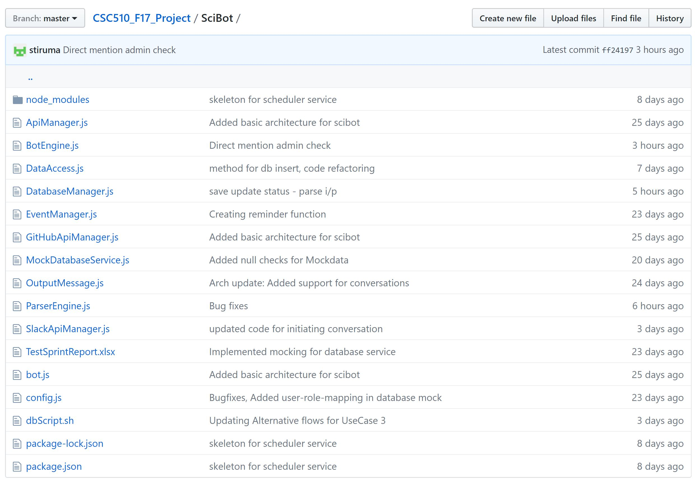

# MILESTONE: SERVICE

## Index
1. [Use Cases](#usecase)
	* [Use Case 1](#usecase1)
	* [Use Case 2](#usecase2)
	* [Use Case 3](#usecase3)
2. [Usecase Implementation](#implement)
3. [Task Tracking](#track)
4. [Screencast](#screencast)

## <a name="usecase"></a> 1. USECASES

### <a name="usecase1"></a> USECASE 1: Pinging a user for daily updates

```
The first use case is to schedule a daily scrum and ask the users questions regarding the work done to get daily updates.
1 Preconditions
  User must have a GitHub account to push all the work done on a daily basis
  User must have a Slack account and be member of the team they are working with
2 Main Flow
  At the end of the day the bot will remind the user to update their daily status[S1] at a particular time of the day, Then bot will ask the user daily scrum meeting questions [S2], like what they did yesterday, what they will do today and if they faced any obstacles. Then this information will be saved in database as their status update [S3].
3 Sub Flow
  [S1] The user signs in.
  [S2] The bot will remind the user to update their daily status. If yes it lets the user sign off.
  [S3] If not, then bot will make sure that ask the user daily scrum meeting questions
  [S4] This information will be saved in their status update
4 Alternative Flows
  [E1] The user is not at work for that day
  
```

### <a name="usecase2"></a> USECASE 2: Generating a summary report
```
The second use case is using the daily status collected from each user the bot will generate a summary report.
1 Preconditions
  The users must have put promptly entered their everyday work
  The admin should have a GitHub and Slack account as well
2 Main Flow
  The daily update collected, is stored in a database [S1] to help keep track of what has been done. The database having saved all the previous activities will all the information, The bot retrieves this information and puts them together to get a summary of the work done[S2].
3 Sub Flows
  [S1] The daily update collected, is stored in a database
  [S2] The bot retrieves this information and puts them together to get a summary of the work done.
4 Alternative Flows
  [E1] User has not updated their work
  
```

### <a name="usecase3"></a> USECASE 3: Providing a manager/admin the ability to configure the setup days/times of the bot.
```
One more use of this bot is for the admin, i.e. the manager is to configure the bot to set up days/times of the bot's ping and summary report.
1 Preconditions
  The admin must have a Slack account and a github account
  The admin must have permissions to configure the bot.
2 Main Flow
  The admin can configure this bot's timings for pinging [S1] the user everyday.The admin can also decide and accordingly configure the bot as to how often they want the summary report to be generated [S2].
3 Sub Flows
  [S1] The admin can configure this bot's timings for pinging
  [S2] The admin can also decide and accordingly configure the bot as to how often they want the summary report to be generated
4 Alternative Flows
  [E1] The admin must have a Slack account
  [E2] The user should not have permissions to configure the bot.

```
## <a name="implement"></a> 2. USECASE IMPLEMENTATION
For our bot we have the following components


We have created and used a PostgreSQL Database to store and retrieve all the user and status information - The tables with its respective attributes which are present can be seen in the file [dbScript](https://github.ncsu.edu/nkumar8/CSC510_F17_Project/blob/master/SciBot/dbScript.sh).

The code for the usecase implementation can be seen in the package [SciBot](https://github.ncsu.edu/nkumar8/CSC510_F17_Project/tree/master/SciBot)

Furthermore, the [class diagram](https://github.ncsu.edu/nkumar8/CSC510_F17_Project/blob/master/ClassDiagram/ClassDiagram.jpg) present in the [design document](https://github.ncsu.edu/nkumar8/CSC510_F17_Project/blob/master/DESIGN.md) for SciBot can be referred to check on the relationship between different files/components available in the image above.

## <a name="track"></a> 3. TASK TRACKING

The file to track our tasks [WORKSHEET.md](https://github.ncsu.edu/nkumar8/CSC510_F17_Project/blob/master/WORKSHEET.md).  
For our milestone we used Github Issues to keep track of our tasks to be done.

## <a name="screencast"></a> 4. SCREENCAST

[Screencast](https://goo.gl/wXkosF) of our service milestone.
